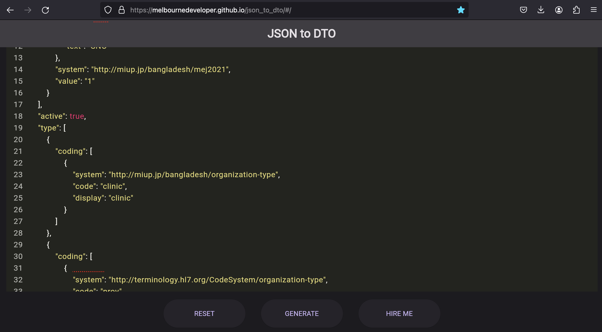
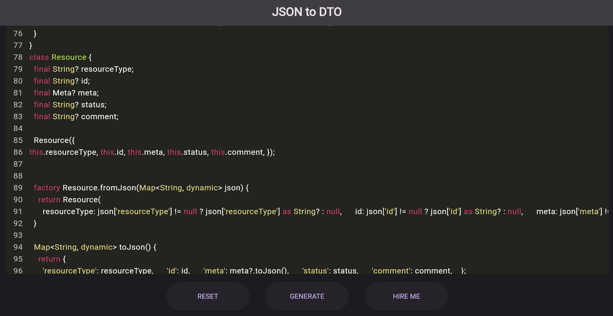

# fhir_client

**Build modern health systems with Flutter and Dart**

This package is a FHIR Server API client for Dart and Flutter. It is designed to be simple and easy to use. It uses the `http` package and Result Objects are [Dart Algebraic Data Types (ADTs)](https://dart.dev/language/patterns#algebraic-data-types), which makes error handling, as well as dealing with the various FHIR Resource types straightforward.

## Show Me The Code

This code searches for practitioner schedules. The code doesn't throw exceptions and you can guarantee it will return one of the two types you see here. This is the beauty of ADTs.

```dart
//Search schedules and limit by count
final searchSchedulesResult =
    await client.searchSchedules(baseUri, count: 10);

//Display the result
print('Schedules:');
print(
  // The result can only be BundleEntries<Schedule> or
  // OperationOutcome<Schedule> so this switch expression is exhaustive
  switch (searchSchedulesResult) {
    (final BundleEntries<Schedule> schedules) =>
      schedules.entries.map(formatSchedule),
    (final OperationOutcome<Schedule> oo) =>
      'Error: ${oo.text!.status}\n${oo.text?.div}',
  },
);
```

## What is FHIR?

[FHIR](https://www.hl7.org/fhir/overview.html) stands for Fast Healthcare Interoperability Resources. It is a standard describing data formats and elements known as "resources" and an application programming interface (API) for exchanging electronic health records (EHR). The standard was created by the Health Level Seven International (HL7) healthcare standards organization, and they own the trademark. 

## What is a FHIR Server?

A [FHIR server](https://build.fhir.org/http.html) is a server that implements the FHIR standard as HTTP REST. It is a server that can store and retrieve FHIR resources. There are several open-source and commercial implementations of the server, and there are [freely available test servers](https://confluence.hl7.org/display/FHIR/Public+Test+Servers). The tests and examples in this repo use the [HAPI test server](https://hapifhir.io/). 

## Is it on-prem? Or Cloud?

The FHIR server can be deployed on-prem or in the cloud. You can license a version of FHIR Server, or you can use an open-source implementation such as [Microsoft's .NET one](https://github.com/microsoft/fhir-server). 

All the major cloud providers have a FHIR server offering: 

- [Google Cloud Cloud Healthcare API](https://cloud.google.com/healthcare-api?hl=en) 
- [AWS HealthLake](https://aws.amazon.com/healthlake/), 
- [Azure Health Data Services](https://azure.microsoft.com/en-us/services/azure-api-for-fhir/)

Privacy and security are paramount in healthcare, so you should choose a provider that is compliant with the [Health Insurance Portability and Accountability Act (HIPAA)](https://www.hhs.gov/hipaa/index.html) and the [General Data Protection Regulation (GDPR)](https://gdpr.eu/). All the major providers offer compliance so there's no need to spend time and effort implementing your own health compliance. 

## A Note on Modern Health Systems

Health systems around the world are fragmented and aging. Many hospitals and doctors still use paper records. The systems that are digital are often old and not interoperable. This is changing rapidly. The FHIR standard is the future of health systems, and health outcomes depend on the interoperability of health records.

If you're working on an aging system that doesn't implement FHIR, you need to consider upgrading to a system that does, or at least implementing a FHIR server that can act as a bridge between your system and other health systems. 

Governments all over the world are mandating FHIR for record keeping and moving to FHIR is a safe bet. This is [what they US government has to say](https://www.hhs.gov/about/news/2023/03/27/new-federal-health-strategy-sights-heathier-innovative-equitable-health-care-experience.html):

> Health IT is integral to how health care is delivered, how health is managed, and how the health of populations and communities is tracked. Thanks in part to the development of common standards, such as the United States Core Data for Interoperability (USCDI) and Health Level Seven International® (HL7®) Fast Healthcare Interoperability Resources® (FHIR®), health information has become more accessible and useful. 

## Getting Started

Just install the `http` package and this one in the usual way. The library adds a bunch of extension methods to the `Client` class and that's it. For example, this example searches for PractitionerRole resources. Notice that using pattern matching with the [`switch` expression](https://www.christianfindlay.com/blog/dart-switch-expressions) is a great way to handle the two possible outcomes of the search because it supports pattern matching.

```dart
  final searchPractitionersResult =
      await client.searchPractitionerRoles(baseUri, count: 10);

  print('PractitionerRoles:');
  print(
    switch (searchPractitionersResult) {
      (final BundleEntries<PractitionerRole> be) => be.entries
          .map(
            (pr) => 'Id: ${pr.id}\nCodes:\n${pr.code?.map(
                  (cc) => cc.coding
                      ?.map(
                        (coding) => ' - '
                            '${coding.code} System: ${coding.system} '
                            '${coding.display}',
                      )
                      .join('\n'),
                ).join('\n')}',
          )
          .join('\n\n'),
      (final OperationOutcome<PractitionerRole> oo) =>
        'Error: ${oo.text!.status}\n${oo.text?.div}',
    },
  );
```

## Testing and Mocking

The library is designed to be easy to test. You can use the [`MockClient`](https://pub.dev/documentation/http/latest/http.testing/MockClient-class.html) class from the `http` package to mock the client. This is how you can mock the client, and you can find [this code](https://github.com/MelbourneDeveloper/fhir_client/blob/e72f37284b1bced7c82f9bef3f079581e4e7b61c/test/fhir_client_test.dart#L361) in the tests. Replace the file path with the path to a JSON file representing the response. This also works in widget tests. 

```dart
MockClient _mockClient(String filePath) => MockClient(
      (r) => Future.value(
        Response(
          File(filePath).readAsStringSync(),
          200,
        ),
      ),
    );
```

Here is an example of using the client extensions with a mocked client.

```dart
group('getResource API Call Tests', () {
  /// A test function that can be called with a mocked client
  /// or a real one
  Future<void> readOrganization(Client client) async {
    const path = 'baseR4/Organization/2640211';

    final result =
        await client.getResource<Organization>(baseUri, path) as Organization;

    expect(result.id, '2640211');
    expect(result.identifier!.first.type!.text, 'SNO');
  }
  // ...
});
```
### Step By Step Guide

1. Use curl to get the JSON response from your FHIR server. For example:

```bash
curl -X GET "http://hapi.fhir.org/baseR4/Organization/2640211" -H "Content-Type: application/json"
```

2. Save the JSON response to a file. For example [this file](test/responses/readorg.json). 

3. Create a `MockClient` in your test using the function above, and pass in the filename.

4. Create a test that calls the extensions with the `MockClient` and the path to the file. For example:

```dart
final client = _mockClient('test/responses/readorg.json');

final result = await client.getResource<Organization>(baseUri, path) as Organization;
```

5. Make your assertions

For widget tests, just inject the `MockClient` at the base of your app instead of the standard `http` `Client`. You will be able to dynamically load JSON files based on the request URI path in the mock function.

## Add A Resource Type (Contributing)

I welcome PRs for this repo and you only need to go through a few steps to add a resource type. I'd like to automatically generate the code once Dart gains full macros, but for the time being, I generate the classes with my [JSON to DTO](https://melbournedeveloper.github.io/json_to_dto/#/) tool.

### Code Generation Approach

1. Grab some example JSON of the resource. You can see examples in the `test/responses` folder.
2. Paste the JSON into the [JSON to DTO](https://melbournedeveloper.github.io/json_to_dto/#/) tool and click "Generate"



3. It will generate a bunch of Dart classes. The main one you are looking for will either be named `Resource`, or `Root`, but the others may also be necessary.



4. Paste the main class in to the file [`resource.dart`](lib/models/resource.dart). The important resources are all in this file because they all inherit from the `Resource` class. The important because it's part of the ADT mechanism. There is no current way to separate these in separate files.

5. Fix up the compilation/static code analysis issues. You should be able to do quick fixes on these, but you might need to manually massage some of the code.

6. Add the resource to the `ResourceType` to the [`ResourceType`](lib/models/value_sets/resource_type.dart) and the `Resource.fromJson` factory.

7. MOST IMPORTANTLY: Add tests to the [`fhir_client_test.dart`](test/fhir_client_test.dart) file. You can see examples of these tests in the file. You need to cover all the fields. You can use an LLM like ChatGPT or Claude to generate these tests for you.

### AI (Claude3 / ChatGPT)

1. Just feed Claude [this file](lib/models/resource.dart) and ask for the FHIR resource. It will generate the class, and you need to connect the other dots.

2. Use curl to generate the test JSON. For example:

> curl -X GET "http://hapi.fhir.org/baseR4/Encounter?_count=2" -H "Content-Type: application/json"

3. Create the search extension or other extensions in [this file](lib/fhir_extensions.dart). 

4. Write tests to verify that the code is reading all the JSON fields into the classes, and that in reverse. Get Claude to write this for you. It's easy. Just feed Clause the JSON file.

## Which Resources Are Supported?

Take a look at [this file](lib/models/resource.dart). You can see the resources that are currently implemented. The aim is to implement all of them in the long run. It's easy to implement them, so feel free to contribute by submitting a PR. Please make sure you cover the code with tests. There are some good existing [tests here](test/fhir_client_test.dart).